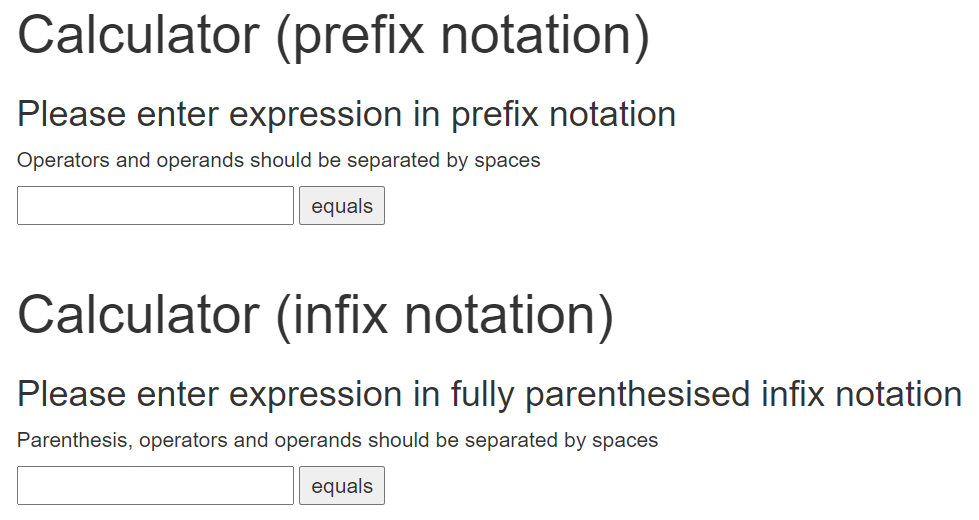

This is a repository hosting a simple calculator that can handle prefix and infix expressions.
You can interact with it both as a web-based application and as a standalone script.

### Requirements:
python version: 3.7  
testing: pytest  
application: flask, wtforms

### Assumptions:
- All the tokens are space-separated, including the parenethesis tokens for infix notation
- Expressions are assumed to be given correctly
- The system should support the operators {+, -, *, /} which all take exactly two args.
- The input literals are positive integers
- Calculations can be done in the floating-point or integer domain
- In case of prefix notation operator precedence is handled by the specifics of the notation 
- In case of infix notation operator precedence is handled by the parenthesis


### How to run:
Option 1:  
>To start the web-based application (on your localhost) run the following:   
 ```$ python main.py --mode web-based```  
open  http://127.0.0.1:7089/ in your browser  
You should be able to see this:


Option 2:
>To use the calculator in a standalone script mode run the following:  
 ```$ python main.py --mode script --expression_type prefix``` for evaluating prefix expression  
 ```$ python main.py --mode script --expression_type infix``` for evaluating infix expression
    